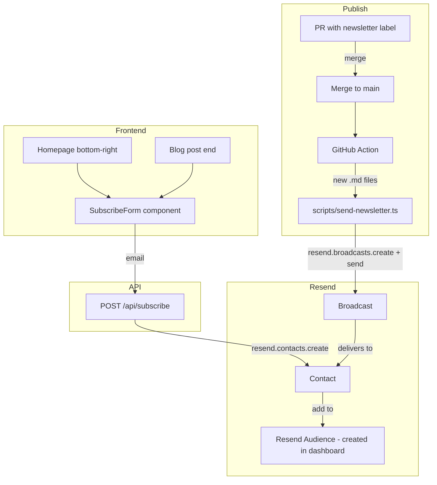

<!-- f4b51c0e-4338-49a1-8b81-214861da32b9 -->
# Resend Email Subscriptions Plan

## Design Language Reference

Your site uses: `text-sm`, `text-neutral-500`, `text-xs uppercase tracking-[0.3em]`, `hover:opacity-70`, fixed positioning, Geist font. The AboutText sits `bottom-6 left-6` with expandable copy.

---

## Proposed Subscribe UI Options

### Option A: Symmetric to AboutText (Recommended)

**Homepage:** Fixed bottom-right, mirroring AboutText. Single line: `[ subscribe ]` link that expands to reveal an inline email input + button on click. Same `text-sm text-neutral-500`, same expand/collapse interaction pattern.

```
[ subscribe ]  →  [ subscribe ] email@... [→]
```

**Blog posts:** Same component at bottom of article, inline after the prose (not fixed). Reads: "Get new posts by email" with minimal input.

### Option B: Always-visible minimal pill

**Homepage:** Small pill/capsule bottom-right: `Subscribe` with a tiny input that appears on hover or stays collapsed until click. Uses your `[10px] uppercase tracking-[0.3em]` style.

**Blog posts:** Same pill at end of article, or a single line: `Subscribe to new posts →` linking to homepage subscribe or opening inline form.

### Option C: Top-right nav addition

**Homepage:** Add `Subscribe` to the topbar nav (next to Feed, Apps, Info) — opens a minimal modal or slides in a panel. Keeps topbar clean; subscribe is one click away.

**Blog posts:** Same topbar link is always visible. Or a subtle `Subscribe` at top-right of the article container only.

---

## Recommendation

**Option A** fits best: it reuses your existing expandable pattern (AboutText), stays out of the way, and feels native. Homepage gets the fixed bottom-right block; blog posts get a non-fixed inline block at the end.

---

## Architecture



---

## Implementation

### 1. Resend setup (manual)

- Create Resend account, add API key
- Create a Segment (e.g. "Newsletter") in Resend dashboard
- Domain: Resend offers `onboarding@resend.dev` for testing. For production, add and verify your domain (e.g. `dylsteck.com`) in Resend dashboard

### 2. Dependencies

- `resend` (Node.js SDK)

### 3. API route: `app/api/subscribe/route.ts`

- `POST` body: `{ email: string }`
- Validate email format
- Call `resend.contacts.create({ email, audienceId })` — Resend still supports `audienceId` for backwards compatibility; if using Segments, use `resend.contacts.create` then `resend.contacts.segments.add`
- Return `{ success: true }` or error
- Resend handles duplicate emails (idempotent)

### 4. SubscribeForm component

- Reusable client component
- Props: `variant: 'fixed' | 'inline'` (fixed = homepage bottom-right, inline = blog end)
- Email input + submit button
- Expand/collapse for fixed variant (like AboutText)
- Call `POST /api/subscribe` on submit
- Success: "Thanks, you're subscribed"
- Error: show message, allow retry

### 5. Placement

- **Homepage** (`app/components/home-content.tsx`): Add `<SubscribeForm variant="fixed" />` — positioned `fixed bottom-6 right-6 z-30`
- **Blog posts** (`app/blog/[id]/page.tsx`): Add `<SubscribeForm variant="inline" />` after the article, inside the section

### 6. Send-on-publish flow: GitHub Actions + PR label

**Trigger:** When a PR is merged to `main` with the `newsletter` label.

**Flow:**
1. Add new blog post via PR (new `.md` file in `app/blog/posts/`)
2. Add label `newsletter` to the PR
3. Merge PR → GitHub Action runs
4. Action fetches PR files via `gh api repos/{owner}/{repo}/pulls/{number}/files`
5. Filter for `status: "added"` and `filename` matching `app/blog/posts/*.md`
6. For each new post, extract slug (filename without .md) and run send logic
7. Send broadcast via Resend API (same logic as script below)

**Workflow file:** `.github/workflows/send-newsletter.yml`

1. Trigger on `pull_request` `types: [closed]`
2. Condition: `merged == true` and label `newsletter` present
3. Checkout, setup bun (`oven-sh/setup-bun`), `bun install`
4. Get PR files: `gh api repos/${{ github.repository }}/pulls/${{ github.event.pull_request.number }}/files --jq '.[] | select(.status=="added") | select(.filename | test("^app/blog/posts/.*\\.md$")) | .filename'`
5. Extract slugs (e.g. `agentic-workspaces.md` → `agentic-workspaces`)
6. For each slug: `bun run scripts/send-newsletter.ts <slug>` (or `node` if using ts-node/tsx)
7. Script uses `getBlogPosts()`, `processMarkdownForRSS()` from shared util, builds HTML, calls `resend.broadcasts.create({ ..., send: true })` (create-and-send in one request)

**Secrets:** `RESEND_API_KEY`, `RESEND_AUDIENCE_ID` in repo secrets.

**Resend UI:** You create and manage the Audience/Segment in Resend dashboard. No need to build audience management in the app — just add contacts via API and send broadcasts. Use Resend dashboard for viewing subscribers, analytics, etc.

### 7. Newsletter email content: Full post HTML (RSS-style)

**Reuse the same MD→HTML pipeline as your RSS feed** so the email body matches what readers would see in an RSS reader.

**Shared util:** Extract `convertMarkdownToHTML` and `processMarkdownForRSS` from `app/rss/route.ts` into `app/lib/markdown-to-html.ts`. Both RSS route and send script import from there.

**Email structure:**
- **Subject:** `New post: {title}`
- **Body:** Full post content as HTML (same as RSS `<content:encoded>`) — i.e. `processMarkdownForRSS(post.content)` which:
  - Replaces `<Tweet>`, `<Cast>`, `<Gallery>` with text refs via `processMarkdownComponents`
  - Converts markdown to HTML via `convertMarkdownToHTML`
- Wrap in email-safe HTML: basic container, `{{{RESEND_UNSUBSCRIBE_URL}}}` in footer, "Read on web" link to `{appUrl}/blog/{slug}`

**RSS parity:** The email body = same HTML as your RSS feed's `content:encoded` for that post. No summary-only; full article in email.

---

## File changes summary

| File | Change |
|------|--------|
| `package.json` | Add `resend` |
| `app/lib/markdown-to-html.ts` | New — shared `convertMarkdownToHTML`, `processMarkdownForRSS` (extracted from RSS) |
| `app/rss/route.ts` | Import from `app/lib/markdown-to-html` instead of inline |
| `app/api/subscribe/route.ts` | New — subscribe API |
| `app/components/subscribe-form.tsx` | New — SubscribeForm component |
| `app/components/home-content.tsx` | Add SubscribeForm (fixed, bottom-right) |
| `app/blog/[id]/page.tsx` | Add SubscribeForm (inline, after article) |
| `scripts/send-newsletter.ts` | New — send logic (used by CI + manual run) |
| `.github/workflows/send-newsletter.yml` | New — CI on PR merge with `newsletter` label |
| `.env.local` | `RESEND_API_KEY`, `RESEND_AUDIENCE_ID` |
| GitHub repo secrets | `RESEND_API_KEY`, `RESEND_AUDIENCE_ID` |

---

## Domain guidance

- **Testing:** Use `onboarding@resend.dev` as sender — works immediately
- **Production:** In Resend dashboard → Domains → Add `dylsteck.com` → Add DNS records (SPF, DKIM, etc.) → Verify. Then use e.g. `newsletter@dylsteck.com` as sender

---

## Double-check summary

- **Subscribe:** Homepage (bottom-right, expandable) + blog post end. Email only, single opt-in. Resend UI for audience management.
- **Send:** PR merge with `newsletter` label → CI runs → fetches new posts in PR → sends broadcast for each. Manual `bun run send-newsletter <slug>` also available.
- **Email content:** Full post HTML via shared MD→HTML util (same as RSS). Unsubscribe link via `{{{RESEND_UNSUBSCRIBE_URL}}}`.
- **Resend setup:** Create audience in dashboard, add `RESEND_API_KEY` and `RESEND_AUDIENCE_ID` to env + GitHub secrets.
